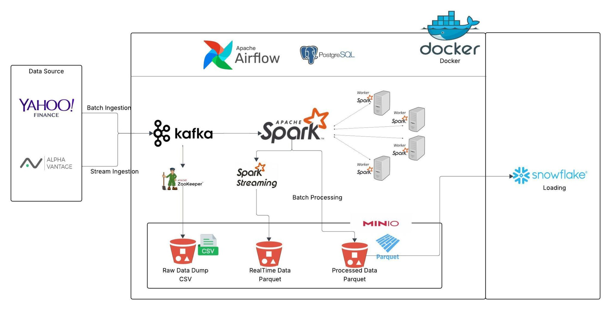

# Stock Market Real-Time Data Streaming Project

🔍 **Project Overview**

This project is a real-time data streaming pipeline for stock market data. We ingest live and historical data from sources like Yahoo Finance, Alpha Vantage, and Twelve Data WebSocket API. The data is processed using Kafka and Spark, stored in MinIO, and sent to Snowflake for analytics. Apache Airflow orchestrates every component, and everything runs inside Docker containers for easy development and deployment.

📊 **Technical Requirements**

### 🧰 Technologies Used

#### **Data Sources**:
- [Yahoo Finance](https://finance.yahoo.com/)
- [Alpha Vantage](https://www.alphavantage.co/)
- [Twelve Data WebSocket API](https://twelvedata.com/)

#### **Streaming and Processing**:
- [Apache Kafka](https://kafka.apache.org/) (For real-time data ingestion and processing)
- [Apache Spark](https://spark.apache.org/) (Batch + Streaming) (For data transformation and analysis)

#### **Storage**:
- [MinIO](https://min.io/) (For storing intermediate results)
- [Snowflake](https://www.snowflake.com/) (For analytics and long-term storage)

#### **Orchestration**:
- [Apache Airflow](https://airflow.apache.org/) (For orchestrating the entire pipeline)

#### **Containerization**:
- [Docker](https://www.docker.com/) & [Docker Compose](https://docs.docker.com/compose/)

#### **Other Tools**:
- PostgreSQL
- Python
- WebSocket
- requests
- yfinance
- kafka-python

---

### Pipeline Architecture

Below is the high-level architecture of the project:

---

🚀 **Current Progress (As of April 2025)**

### ✅ Dockerized Infrastructure (DONE)
- Kafka (3 brokers), Zookeeper
- Spark Master + 3 Workers (resource-limited)
- PostgreSQL
- MinIO
- Airflow Webserver + Scheduler
- Custom container for data ingestion scripts
- Kafka volume-based persistence implemented
- Automatic topic creation with partitions and replication factor

### ✅ Historical Data Ingestion (DONE)
- `ingest_historical_yahoo.py`: Stores daily OHLCV data to Kafka/MinIO.
- `ingest_historical_alpha.py`: Same logic for Alpha Vantage.

### ✅ Real-Time Streaming Ingestion (DONE)
- `ingest_realtime_yahoo.py`: Simulates live data by looping historical day data.
- `ingest_realtime_alpha_vantage.py`: Loops Alpha's 1-minute endpoint.
- `ingest_realtime_twelvedata_ws.py`: Full WebSocket-based live feed.
- Kafka Producer logging and connection check added.

### ✅ Scripts Containerization (DONE)
- Dockerfile with:
  - Dependencies in `requirements.txt`
  - `scripts/` folder copied
- Can `docker exec` to launch manually or used in Airflow later.

---

📆 **Project Structure (Simplified)**

├── dags/ # Airflow DAGs (to be implemented)
├── scripts/ # Python ingestion scripts
├── config/ # API + Kafka config JSONs
├── logs/ # Airflow logs
├── requirements.txt # Python dependencies
├── Dockerfile # For custom ingestion container
├── .dockerignore
├── docker-compose.yml # Full pipeline orchestration
└── README.md # This file

---

✅ **What's Next**

- **Spark Structured Streaming**: Consume and transform Kafka data.
- **Store Processed Data in MinIO**: Save intermediate results in Parquet format.
- **Archive and Compact Topics**: Manage Kafka topics efficiently.
- **Export Processed Data to Snowflake**: Use Airflow to load data into Snowflake.
- **Orchestrate Ingestion + ETL in Airflow DAGs**: Automate the entire pipeline.
- **Optional Cloud Deployment**: Deploy on ECS / EC2 / Azure.

---

🔎 **Screenshots (To Add)**
- Airflow UI
- MinIO bucket structure
- Spark UI with running job
- Kafka CLI producing/consuming messages

---

📂 **GitHub Repo**
[https://github.com/marwenmejri/Stock-Market-Real-Time-Data-Streaming](https://github.com/marwenmejri/Stock-Market-Real-Time-Data-Streaming)

This repo is under active development. Contributions and feedback are welcome!

---

📅 **Maintained by**
Marwen Mejri - Senior Data Engineer

Let's stream the market ⚡