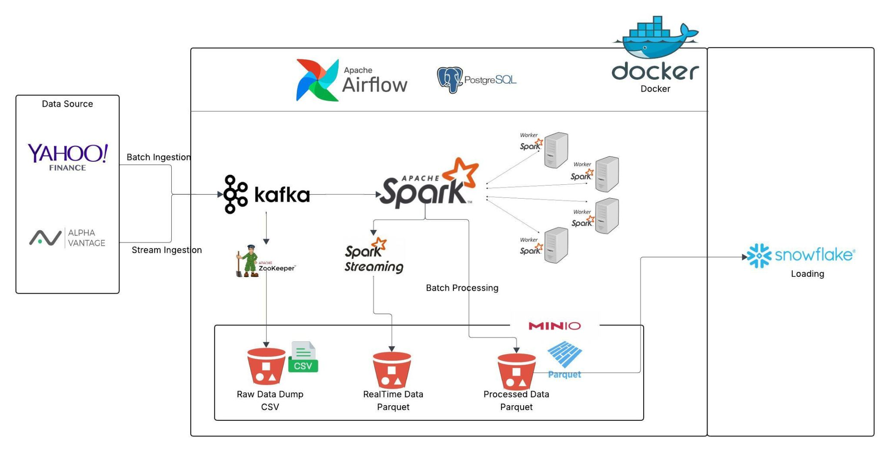

# Stock Market Real-Time Data Streaming Project

## Project Overview
This project is designed to build a real-time data streaming pipeline for stock market data using open-source tools and technologies. The goal is to ingest financial data from sources like Yahoo Finance and Alpha Vantage, process it in real-time using Apache Kafka and Apache Spark, store intermediate results in Minio, and load the final processed data into Snowflake for analysis.

The entire pipeline will be containerized using Docker, and Apache Airflow will be used to orchestrate the workflow.

---

## Technical Requirements

### Technologies Used
- **Data Sources**: 
  - [Yahoo Finance API](https://finance.yahoo.com/)
  - [Alpha Vantage API](https://www.alphavantage.co/)
- **Streaming and Processing**:
  - [Apache Kafka](https://kafka.apache.org/)
  - [Apache Spark](https://spark.apache.org/) (Batch + Streaming)
- **Storage**:
  - [Minio](https://min.io/) (Object Storage)
  - [Snowflake](https://www.snowflake.com/) (Cloud Data Warehouse)
- **Orchestration**:
  - [Apache Airflow](https://airflow.apache.org/)
- **Database**:
  - [PostgreSQL](https://www.postgresql.org/) (Metadata/Intermediate Results)
- **Containerization**:
  - [Docker](https://www.docker.com/)

---

### Pipeline Architecture

Below is the high-level architecture of the project:

---

### Implementation Plan

#### Phase 1: Setup Environment
1. **Install Docker**:
   - Install Docker on your local machine or server.
   - Use Docker Compose to set up Kafka, Zookeeper, Spark, Minio, PostgreSQL, and Airflow.

2. **Configure Kafka and Zookeeper**:
   - Start Kafka brokers and Zookeeper using Docker.
   - Create Kafka topics for real-time data ingestion.

3. **Set Up Minio**:
   - Deploy Minio using Docker.
   - Configure storage buckets for raw, real-time, and processed data.

4. **Deploy PostgreSQL**:
   - Use Docker to deploy PostgreSQL.
   - Create databases and tables for metadata storage.

5. **Deploy Airflow**:
   - Use Docker to deploy Airflow.
   - Configure Airflow to interact with Kafka, Spark, Minio, and Snowflake.

#### Phase 2: Data Ingestion
1. **Batch Ingestion**:
   - Write Python scripts to fetch historical stock data from Yahoo Finance and Alpha Vantage.
   - Store the data in CSV format in Minio.

2. **Stream Ingestion**:
   - Write Python scripts to continuously fetch real-time stock data.
   - Push the data to Kafka topics.

#### Phase 3: Real-Time Processing
1. **Spark Streaming**:
   - Write Spark Streaming applications to consume data from Kafka topics.
   - Perform real-time transformations and write the processed data to Minio in Parquet format.

#### Phase 4: Batch Processing
1. **Spark Batch Processing**:
   - Write Spark batch applications to process historical data stored in Minio.
   - Perform batch transformations and store the processed data in Minio.

#### Phase 5: Data Loading into Snowflake
1. **Load Data into Snowflake**:
   - Use Airflow to schedule the loading of processed data from Minio into Snowflake.
   - Use Snowflake’s COPY command to efficiently load Parquet files.

#### Phase 6: Orchestration
1. **Define Airflow DAGs**:
   - Create DAGs to orchestrate the entire pipeline:
     - Data ingestion tasks.
     - Real-time and batch processing tasks.
     - Data loading tasks.
   - Schedule the DAGs to run at specific intervals (e.g., hourly, daily).

#### Phase 7: Monitoring and Testing
1. **Monitor the Pipeline**:
   - Use Airflow’s UI to monitor the status of DAGs and tasks.
   - Monitor Kafka topics, Spark jobs, and Minio storage.

2. **Test the Pipeline**:
   - Test the end-to-end pipeline with sample data.
   - Ensure data consistency between Minio and Snowflake.

---

### Conclusion
This project demonstrates a comprehensive data engineering pipeline that integrates real-time and batch processing using open-source tools. It provides a scalable solution for ingesting, processing, and analyzing stock market data.